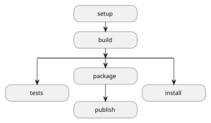
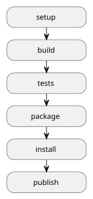
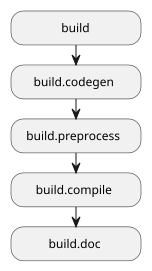

(allTasks)=

# Tasks

The **`nmk-base`** plugin defines the tasks described below.

---

## Meta tasks

This plugin defines some meta tasks that can be used by other plugins as kind of build "phases". Depending on what the user want to do, the different available workflows are illustrated by the diagram below:



```{note}
As **`nmk`** supports any tasks combination, it is possbile to get any other build workflow combination by specifying the task names on the command line.

E.g. an `nmk tests package install publish` command results in the following workflow:


```

---

(setup)=

### **`setup`** task

The **`setup`** task aims to be the first phase of the build, allowing to perform prebuild operations like config files generation, dependencies checking, etc...

---

(build)=

### **`build`** task

The **`build`** task shall be used to perform all operation that build temporary and/or artifact files for the current project.

It is the **default** build task (i.e. this is the built task when **`nmk`** is invoked without argument).

It firstly depends on the **{ref}`setup<setup>`** task, and is then composed of several sub-tasks, allowing plugins to easily contribute to a given build phase. These sub-tasks are detailed in the following chapters.



---

(build.codegen)=

#### **`build.codegen`** task

The **`build.codegen`** task can be used to hook any code generation task, i.e. any process that creates/updates source code files expecting to be part of the build.

_<span style="color:green">Added in version 1.5.0</span>_

---

(build.preprocess)=

#### **`build.preprocess`** task

The **`build.preprocess`** task can be used to hook any code preprocessing task, e.g.:

- code format
- code linting/static analysis
- etc...

_<span style="color:green">Added in version 1.5.0</span>_

---

(build.compile)=

#### **`build.compile`** task

The **`build.compile`** task can be used to hook any compilation task (whatever it means for any supported programming language)

_<span style="color:green">Added in version 1.5.0</span>_

---

(build.doc)=

#### **`build.doc`** task

The **`build.doc`** task can be used to hook any documentation build task.

_<span style="color:green">Added in version 1.5.0</span>_

---

(tests)=

### **`tests`** task

The **`tests`** task shall be used to perform all automated testing operations on generated software.

It depends on the **{ref}`build<build>`** task.

---

(package)=

### **`package`** task

The **`package`** task shall be used to package project artifacts from generated software.

It depends on the **{ref}`build<build>`** task.

---

(install)=

### **`install`** task

The **`install`** task shall be used to install generated software locally.

It depends on the **{ref}`build<build>`** task.

---

(publish)=

### **`publish`** task

The **`publish`** task shall be used to publish built artifacts where they should be stored, as decided by the project.

It depends on the **{ref}`package<package>`** task.

---

(clean)=

### **`clean`** task

The **`clean`** task shall be used to clean the project built files.

---

## Helper tasks

---

(version)=

### **`version`** -- display version

| Property | Value/description                           |
| -------- | ------------------------------------------- |
| builder  | {py:class}`nmk_base.helpers.VersionBuilder` |

The **`version`** task will list the versions of **`nmk`** itself, plus all plugin versions contributed to {ref}`${nmkPluginsVersions}<nmkPluginsVersions>` object.

> Example:
>
> ```
> $ nmk version
> 2022-02-20 14:37:02 (I) [version] 🏷  - Display used nmk + plugins versions
> 2022-02-20 14:37:02 (I) [version] 🏷  -  👉 nmk: 0.0.0.post37+gf907587
> 2022-02-20 14:37:02 (I) [version] 🏷  -  👉 base: 1.0.0
> 2022-02-20 14:37:02 (I) nmk 🏁 - Done
> ```

---

(help)=

### **`help`** -- display help links

| Property | Value/description                        |
| -------- | ---------------------------------------- |
| builder  | {py:class}`nmk_base.helpers.HelpBuilder` |

The **`help`** task will list the help page URL of **`nmk`** itself, plus all plugin pages URLs contributed to {ref}`${nmkPluginsDocs}<nmkPluginsDocs>` object.

> Example:
>
> ```
> $ nmk help
> 2022-02-20 14:42:24 (I) [help] 🆘 - Display online help links
> 2022-02-20 14:42:24 (I) [help] 🆘 -  👉 nmk: https://nmk.readthedocs.io/
> 2022-02-20 14:42:24 (I) [help] 🆘 -  👉 base: https://nmk-base.readthedocs.io/
> 2022-02-20 14:42:24 (I) nmk 🏁 - Done
> ```

---

(tasks)=

### **`tasks`** -- list known tasks

| Property | Value/description                            |
| -------- | -------------------------------------------- |
| builder  | {py:class}`nmk_base.helpers.TaskListBuilder` |

The **`tasks`** task will list all the known tasks for the built project.

> Example:
>
> ```
> $ nmk tasks
> 2022-02-20 14:43:18 (I) [tasks] 🗃 - List all available tasks
> 2022-02-20 14:43:18 (I) [tasks] 🧹 -  👉 clean: Clean build output
> 2022-02-20 14:43:18 (I) [tasks] 🛫 -  👉 setup: Setup project configuration
> 2022-02-20 14:43:18 (I) [tasks] 🛠 -  👉 build: Build project artifacts
> 2022-02-20 14:43:18 (I) [tasks] 🤞 -  👉 tests: Run automated tests
> 2022-02-20 14:43:18 (I) [tasks] 🏷 -  👉 version: Display used nmk + plugins versions
> 2022-02-20 14:43:18 (I) [tasks] 🆘 -  👉 help: Display online help links
> 2022-02-20 14:43:18 (I) [tasks] 🗃 -  👉 tasks: List all available tasks
>
> ...
>
> 2022-02-20 14:42:24 (I) nmk 🏁 - Done
> ```

---

### **`git.clean`** -- full clean

| Property | Value/description                 |
| -------- | --------------------------------- |
| builder  | {py:class}`nmk_base.git.GitClean` |

The **`git.clean`** task will use git to clean the project folder, i.e. by removing all git ignored files.

**Warning:** this will remove (at least) both the **`venv`** and **`.nmk`** folders. Consequently, the build will immediately stop after this task, ignoring other tasks eventually specified on the command line. After this task is executed, the **`buildenv`** loading scripts will have to be used again to setup the project and reinstall **`nmk`**

---

## Setup tasks

All tasks in this chapter are dependencies of the main **{ref}`setup<setup>`** task.

---

(buildenv)=

### **`buildenv`** -- buildenv loading scripts generation

| Property | Value/description                                 |
| -------- | ------------------------------------------------- |
| builder  | {py:class}`nmk_base.buildenv.BuildenvInitBuilder` |
| input    | {ref}`${venvState}<venvState>` file               |
| output   | buildenv loading scripts                          |
| if       | {ref}`${buildenvRefresh}<buildenvRefresh>`        |

The **`buildenv`** task updates [buildenv](https://buildenv.readthedocs.io) loading scripts, aiming to be persisted in project repository, and allowing to:

- create a local python venv where **`nmk`** (and all python dependencies of the project) will be installed
- enable this venv

---

(git.version)=

### **`git.version`** -- git version update

| Property | Value/description                               |
| -------- | ----------------------------------------------- |
| builder  | {py:class}`nmk_base.git.GitVersionRefresh`      |
| output   | {ref}`${gitVersionStamp}<gitVersionStamp>` file |
| deps     | {ref}`out<out>` task                            |

This task is used to update the {ref}`${gitVersionStamp}<gitVersionStamp>` file, each time the {ref}`${gitVersion}<gitVersion>` value is updated (new commit, new tag...)

---

(git.ignore)=

### **`git.ignore`** -- generate .gitignore file

| Property | Value/description                                                                     |
| -------- | ------------------------------------------------------------------------------------- |
| builder  | {py:class}`nmk_base.git.GitIgnore`                                                    |
| input    | {ref}`${gitIgnore}<gitIgnore>` & {ref}`${gitIgnoreTemplate}<gitIgnoreTemplate>` files |
| output   | {ref}`${gitIgnore}<gitIgnore>` & {ref}`${gitIgnoreStamp}<gitIgnoreStamp>` files       |
| deps     | {ref}`out<out>` task                                                                  |

This task is used to update the {ref}`${gitIgnore}<gitIgnore>` file with a fragment generated from the list of ignored files configured in {ref}`${gitIgnoredFiles}<gitIgnoredFiles>` item.

Notes:

- Project-relative paths are automatically made relative to project root.
- Non project-relative absolute paths are ignored when generating the fragment.

---

(git.attributes)=

### **`git.attributes`** -- generate .gitattributes file

| Property | Value/description                                                                               |
| -------- | ----------------------------------------------------------------------------------------------- |
| builder  | {py:class}`nmk_base.git.GitAttributes`                                                          |
| output   | {ref}`${gitAttributes}<gitAttributes>` & {ref}`${gitAttributesStamp}<gitAttributesStamp>` files |
| deps     | {ref}`out<out>` task                                                                            |

This task is used to update the {ref}`${gitAttributes}<gitAttributes>` file with a fragment generated from the following config items:

- {ref}`${linuxLineEndings}<linuxLineEndings>`: list of file extensions (".xxx" format) requiring to be systematically handled with Linux line endings
- {ref}`${windowsLineEndings}<windowsLineEndings>`: list of file extensions (".xxx" format) requiring to be systematically handled with Windows line endings

---

(py.req)=

### **`py.req`** -- generate python venv requirements file

| Property | Value/description                                                                                                                                      |
| -------- | ------------------------------------------------------------------------------------------------------------------------------------------------------ |
| builder  | {py:class}`nmk_base.common.TemplateBuilder`                                                                                                            |
| input    | {ref}`${venvArchiveDeps}<venvArchiveDeps>` & {ref}`${venvFileDeps}<venvFileDeps>` & {ref}`${venvRequirementsTemplate}<venvRequirementsTemplate>` files |
| output   | ${PROJECTDIR}/{ref}`${venvRequirements}<venvRequirements>` file                                                                                        |
| if       | {ref}`${backendUseRequirements}<backendUseRequirements>`<br> <br>_<span style="color:green">Added in version 1.2.0</span>_                             |

This task merges all python venv requirements in one single generated file ({ref}`${venvRequirements}<venvRequirements>`). This file is used:

- by "buildenv" loading scripts to bootstrap the project just after the clone
- by {ref}`py.venv<py.venv>` task to update the venv when requirements change during the project lifecycle

It is triggered only if:

- the current environment backend uses a requirements file
- one of referenced requirement files (from {ref}`${venvFileDeps}<venvFileDeps>` config list) is updated
- one of referenced archive files (from {ref}`${venvArchiveDeps}<venvArchiveDeps>` config list) is updated
- the requirements template (from {ref}`${venvRequirementsTemplate}<venvRequirementsTemplate>` config list) is updated
- project files are updated

---

(py.venv)=

### **`py.venv`** -- update python venv

| Property | Value/description                                                                                                                                                                     |
| -------- | ------------------------------------------------------------------------------------------------------------------------------------------------------------------------------------- |
| builder  | {py:class}`nmk_base.venvbuilder.VenvUpdateBuilder`                                                                                                                                    |
| input    | {ref}`${venvUpdateInput}<venvUpdateInput>` file<br> <br>_<span style="color:orange">Changed in version 1.2.0</span>_<br>Previous static value was `${PROJECTDIR}/${venvRequirements}` |
| output   | {ref}`${venvRoot}<venvRoot>` & {ref}`${venvState}<venvState>` files                                                                                                                   |
| deps     | {ref}`out<out>` & {ref}`py.req<py.req>` tasks                                                                                                                                         |

This task updates the Python venv from the expected requirements, as soon as they are updated (i.e. when {ref}`${venvRequirements}<venvRequirements>` file changes).

It also generates a dump ({ref}`${venvState}<venvState>`) of all installed packages (using the [pip requirement specifiers syntax](https://pip.pypa.io/en/stable/reference/requirement-specifiers/)); this dump can be used to compare builds, and/or to restore a previous build exact venv environment (from troubleshooting or others...)

```{note}
_<span style="color:green">Added in version 1.2.0</span>_

If the current environment backend is not mutable (e.g. if it is a temporary venv created by **`pipx`** or **`uvx`** tool), this task won't run and the build will stop.
Instead, instructions are provided to update the environment:
- either exit and re-enter the environment to apply changes
- or call `buildenv upgrade` command to spawn a new upgraded environment
```

---

(out)=

### **`out`** -- output folder creation

| Property | Value/description                        |
| -------- | ---------------------------------------- |
| builder  | {py:class}`nmk_base.common.MkdirBuilder` |
| output   | {ref}`${outputDir}<outputDir>` folder    |

This task simply silently creates the {ref}`${outputDir}<outputDir>` folder. All tasks aiming to create files in this folder should reference this task.

---

## Clean tasks

All tasks in this chapter are dependencies of the main **{ref}`clean<clean>`** task.

---

### **`clean.out`** -- output cleaning

| Property | Value/description                        |
| -------- | ---------------------------------------- |
| builder  | {py:class}`nmk_base.common.CleanBuilder` |
| path     | {ref}`${outputDir}<outputDir>` folder    |

The **`clean.out`** task will simply remove the {ref}`${outputDir}<outputDir>` folder and its entire content.

> Usage example:
>
> ```
> $ nmk clean
> 2022-02-20 14:37:54 (I) [clean.out] 🧹 - Clean build output
> 2022-02-20 14:37:54 (I) nmk 🏁 - Done
> ```

---

## Prologue tasks

All tasks in this chapter are dependencies of the built-in **prologue** task (i.e. systematically executed before all tasks specified on the comand line).

---

(sys.deps)=

### **`sys.deps`** -- check for system dependencies

| Property | Value/description                                   |
| -------- | --------------------------------------------------- |
| builder  | {py:class}`nmk_base.sysdeps.SystemDepsCheckBuilder` |

This task checks if system requirements (specified in {ref}`${systemDeps}<systemDeps>` item) are installed. If not, it displays install instructions and stops the build in error.

The builder is called with the following parameters mapping:

| Name | Value                                |
| ---- | ------------------------------------ |
| deps | **{ref}`${systemDeps}<systemDeps>`** |

> Example configuration:
>
> ```yaml
> systemDeps:
>   git:
>     apt: ["git"]
>     url: https://git-scm.com/downloads
> ```
>
> If git is not installed:
>
> ```
> $ nmk sys.deps
> 2024-11-22 07:40:22 (W)  [sys.deps] ❗ - Missing system dependencies: git
> 2024-11-22 07:40:22 (W)  [sys.deps] ❗ - Install instructions:
> 2024-11-22 07:40:22 (W)  [sys.deps] ❗ - * for global system install, use this command: "sudo apt install git"
> 2024-11-22 07:40:22 (W)  [sys.deps] ❗ - * for "git" manual user install: see https://git-scm.com/downloads
> 2024-11-22 07:40:22 (E) nmk 💀 - An error occurred during task sys.deps build: Please install missing system dependencies (see above)
> ```

---

## Epilogue tasks

All tasks in this chapter are dependencies of the built-in **epilogue** task (i.e. systematically executed after all tasks specified on the comand line).

---

(git.dirty)=

### **`git.dirty`** -- check for dirty project folder

| Property | Value/description                                              |
| -------- | -------------------------------------------------------------- |
| builder  | {py:class}`nmk_base.git.GitIsDirty`                            |
| if       | {ref}`${gitEnableDirtyCheck}<gitEnableDirtyCheck>` flag is set |

This task verifies if project folder is dirty (e.g. contains not committed updated files). In this case, it makes the build failing and displays the diff.
